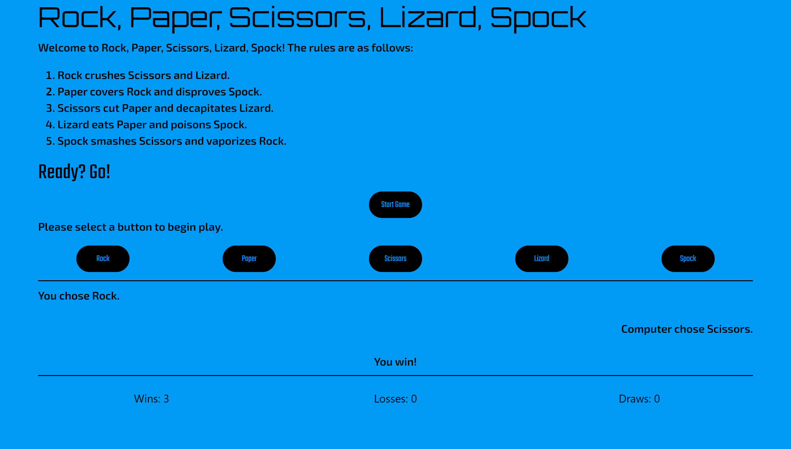

# jQuery Rock, Paper, Scissors, Lizard, Spock

## Table of Contents

* [Description](#description)
* [Links](#links)
* [Screenshots](#screenshots)
* [Installation Instructions](#installation-instructions)
* [Usage](#usage)
* [Technologies Used](#technologies-used)
* [Tests](#tests)
* [Credits](#credits)
* [Contributing](#contributing)
* [Questions](#questions)
* [Badges](#badges)

## Description

Just a quick &amp; dirty little game of Rock, Paper, Scissors, Lizard, Spock, playing against the computer.

## Links

[Play Rock, Paper, Scissors, Lizard, Spock](https://lauracole1900.github.io/js-rpszk/)

## Screenshots

Play page:

## Installation Instructions

N/A

## Usage

This project is intended to be used as a casual game.

## Technologies Used

   

## Tests

N/A

## Credits

"Rock, Paper, Scissors, Lizard, Spock" was created by the folks at "The Big Bang Theory".

## Contributing

N/A

## Questions

If you have further questions, you can reach me at lauracole1900@comcast.net. For more of my work, see [my GitHub](https://github.com/LauraCole1900).

## Badges

 